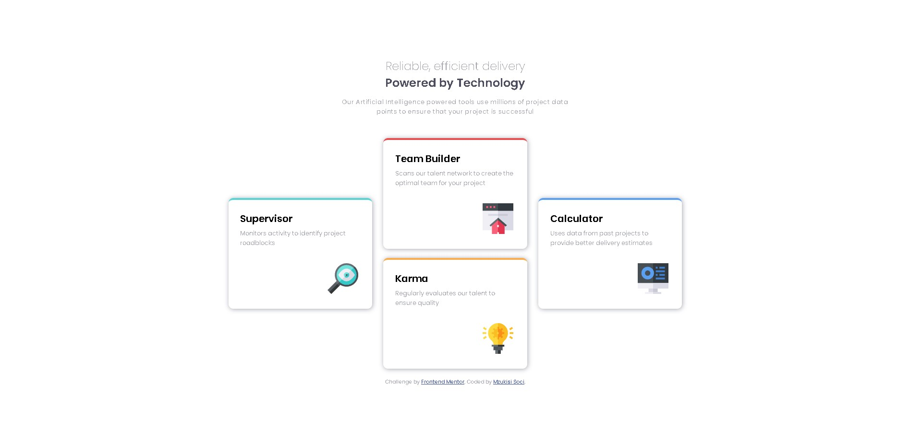
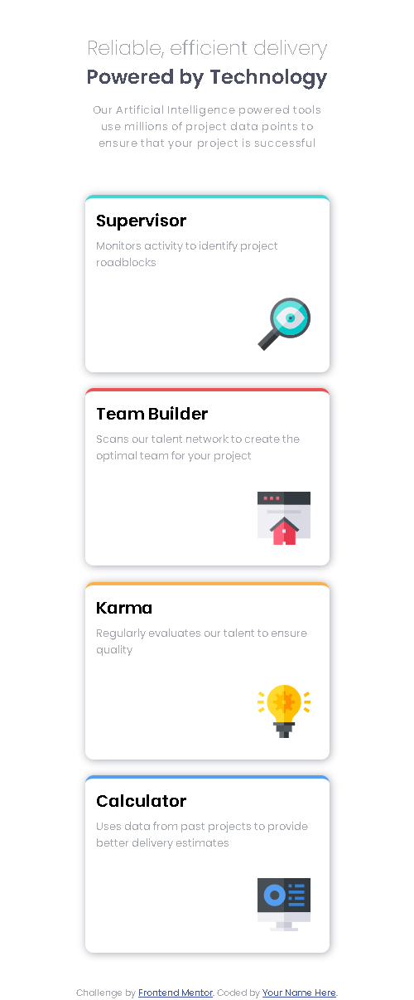

# Frontend Mentor - Four card feature section solution

This is a solution to the [Four card feature section challenge on Frontend Mentor](https://www.frontendmentor.io/challenges/four-card-feature-section-weK1eFYK). Frontend Mentor challenges help you improve your coding skills by building realistic projects.

## Table of contents

- [Overview](#overview)
  - [The challenge](#the-challenge)
  - [Screenshot](#screenshot)
  - [Links](#links)
- [My process](#my-process)
  - [Built with](#built-with)
  - [Continued development](#continued-development)
- [Author](#author)

## Overview

### The challenge

Users should be able to:

- View the optimal layout for the site depending on their device's screen size

### Screenshot

### Links

- Solution URL: [https://github.com/Mzu-Soci/Four-card-feature-section]
- Live Site URL: [https://mzu-soci.github.io/Four-card-feature-section/]

## My process

- tagged all elements and added divs for mobile site - created and linked css file
- formated the page from the top div working my way down.
- wrote media queries for mobile site
- edited css for desktop site
- wrote media queries for desktop site.

### Built with

- Semantic HTML5 markup
- CSS custom properties
- Flexbox
- Mobile-first workflow

### Continued development

Make this layout more responsive.

## Author

- Frontend Mentor - [@Mzu-Soci](https://www.frontendmentor.io/profile/Mzu-Soci)
- LinkedIn - [Mzukisi Soci](https://www.linkedin.com/in/mzukisi-soci-308521140/)
